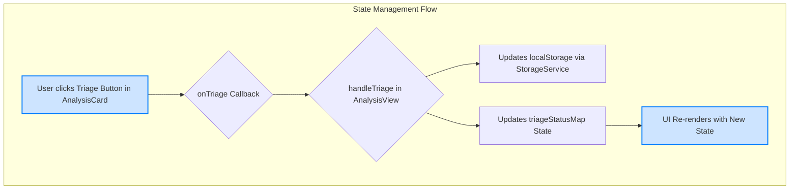
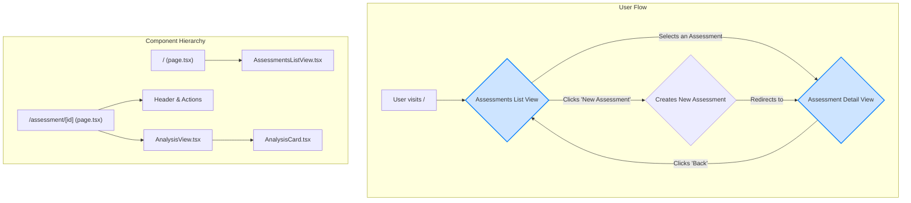

# CPAnalyzer Architecture

This document provides a comprehensive overview of the CPAnalyzer application, intended to be used by developers and AI agents to understand the codebase for future feature development.

## 1. High-Level Overview

CPAnalyzer is a web application designed to analyze charter party agreements in the shipping industry. It identifies risks, conflicts, and other important information to assist users in making informed decisions. The application reads pre-analyzed JSON files containing risk assessments and conflict analyses for various vessels and charter parties.

The application is built using the following technologies:

-   **Next.js**: A React framework for building server-rendered web applications.
-   **TypeScript**: A typed superset of JavaScript that enhances code quality and maintainability.
-   **shadcn/ui**: A collection of reusable UI components for building modern web interfaces.
-   **Tailwind CSS**: A utility-first CSS framework for rapid UI development.

## 2. Frontend Architecture

The frontend is built with the Next.js App Router, providing a solid foundation for a fast and scalable application.

### 2.1. Directory Structure

The repository root is the application root. The `src` directory is organized as follows:

-   **`app/`**: Contains the application's pages and layouts.
    -   `page.tsx`: The main entry point, displaying the list of assessments.
    -   `assessment/[id]/page.tsx`: The detail view for a single assessment.
-   **`components/`**: Houses all React components, organized by domain.
-   **`lib/`**: Includes utility functions, helper scripts, and libraries (e.g., `assessment-utils.ts`).
-   **`types/`**: Defines all TypeScript types and interfaces used throughout the application.
-   **`public/`**: Stores static assets, including images and initial JSON data files.
-   **`docs/`**: Contains all project documentation.

### 2.2. Styling

The application uses Tailwind CSS for styling. This utility-first CSS framework allows for rapid development and ensures a consistent design system. Global styles and theme variables are defined in `src/app/globals.css`.

## 3. Data & State Management

### 3.1. Data Flow & Storage

The application uses a reactive, unidirectional data flow, which ensures that the UI is always a direct reflection of the application's state. This makes the codebase more predictable, easier to debug, and highly maintainable.

1.  **Single Source of Truth**: The `AnalysisView` component serves as the "single source of truth" for the state of the analysis items, including their triage status. All state updates are managed centrally within this component.

2.  **Unidirectional Data Flow**:
    -   State flows down from parent components to children via props (e.g., `AnalysisView` passes triage status down to `AnalysisCard`).
    -   Actions flow up from children to parents via callbacks (e.g., `AnalysisCard` calls an `onTriage` function passed down from `AnalysisView`).
    -   This strict, one-way flow eliminates entire classes of state-synchronization bugs.

3.  **Centralized Storage (`StorageService`)**: The `src/lib/storage-service.ts` file encapsulates all interactions with the browser's `localStorage`. This service is the single source of truth for all *persisted* data.

4.  **Authentication (`useAuth` Hook)**: The `src/hooks/useAuth.ts` custom hook manages all authentication-related state, interacting with the `StorageService` to persist login status.

5.  **Multi-Tenancy**: The application supports multiple tenants with isolated data access. Each user is mapped to a tenant, and assessments are filtered based on tenant access permissions.

### 3.2. State Management Diagram

## 4. Data Structure

### Assessment Files
Each assessment requires two JSON files in the `/public` directory:
- `{assessment_id}_risks.json` - Contains risk analysis items
- `{assessment_id}_conflicts.json` - Contains conflict analysis items

These files are loaded dynamically when an assessment is selected.

## 5. Component Architecture

The component architecture is designed to be modular and reusable. Key components include:

-   **`AnalysisView`**: The main container for the analysis page. It manages all data fetching and state for the analysis items.
-   **`AnalysisCard`**: A "dumb" presentational component that displays a single analysis item. It receives all data and handlers via props.
-   **`AnalysisFilterTabs`**: Displays the filter tabs and their counts. Its configuration is exported to decouple it from its parent.
-   **`AnalysisEmptyState`**: A dedicated component for displaying a message when no analysis items are available.

## 6. Architecture Diagram

The following diagram illustrates the high-level user flow and component architecture:

## 7. MCP Configuration

For AI-assisted development with Claude Code or Cursor, the project supports MCP (Model Context Protocol) configuration. Create `.cursor/mcp.json` in the project root with the appropriate Supabase access token for enhanced AI capabilities.

## 8. Further Reading

For more in-depth information, please refer to the following documents:

-   **[Contributing](./CONTRIBUTING.md)**: Guidelines for contributing to the project.
-   **[Deployment](./DEPLOYMENT.md)**: Instructions for deploying the application.
-   **[Design System](./DESIGN.md)**: Information on the design system and styling guidelines.
-   **[Code Improvements](./code-improvements.md)**: A list of completed and suggested code improvements.

This document serves as the primary guide to the current architecture and will be updated as the application evolves.

